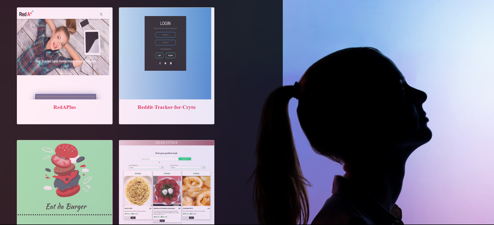

<h1 align="center"> Shiva's Portfolio🙂</h1>

 

## Description 

It is a personal static website/portfolio  hosted with GitHub Pages, built to showcase my recent projects. <h4>Click [here](https://shiva-shiva.github.io/Shiva-Portfolio/) for demo.</h4>

## ✨Demo

## ✔️ Structure
### Navigation bar

    Portfolio
    Contact 
    Resume | About me

### About Me

     Display picture
     Technical Skills
     Soft Skills
     About myself, my Interests, Goals and Hobbies

### portfolio

     Recent Projects (using GitHub API)

### Footer

     Copyrights - open source
    
## Features

    Bootstrap - CSS framework 
    React library 

## 📝License
MIT License 
       

## Questions
 :octocat: Find me on GitHub:[shiva-shiva](https://github.com/shiva-shiva) 
     
    ✉️ Email me with any questions: shivasabokdast@gmail.com  